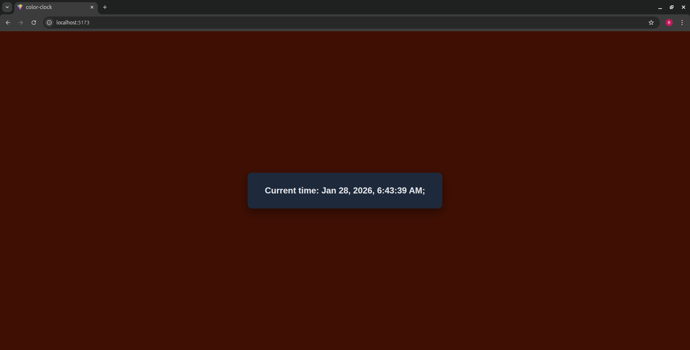

#  Color Clock (React + Vite)

# Description
This project is asimple React application that displays the current date and time.

# Tools
this project has been built using
-React
-vite
-Javascript
-date-fns
-CSS

# Setup
follow these step to run the project locally

-clone te repository: clone the color-clock repository to your local machine using git.

 git clone: 

- navigate into the project folder 
   cd color-clock

 -install Dependancies  
   npm install

- install date-fns
  npm install date-fns@2.30.0

- Run the Application
  npm run dev
you will see the link http://localhost:5173/ on your terminal copy it and run on the browser .
Date and current Time will appear.

# Additinal setup instruction
Before you run the npm run dev make sure you have install dependancies and install date-fns.

# Screenshots

# # licenses
color-clock is licenced under the MT licences see the LICENSE file for more details

# Author
** Robert Mmasi**
Software Enginnering Student
I am software enginnering student at moringa school passionate about bulding web applications and learning modern React technologies.
i built color-clock using react and date-fns plus CSS.
this project shows the current date and time.